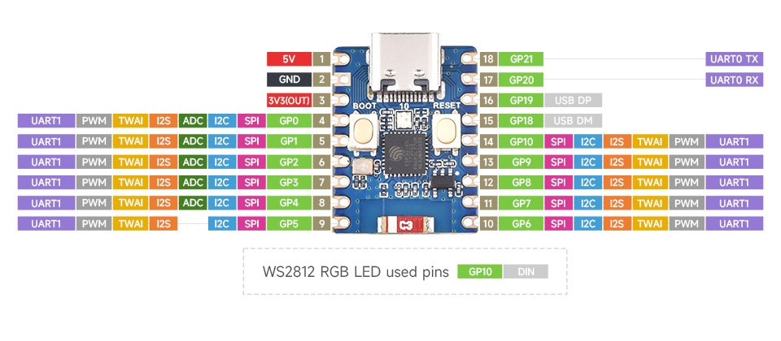
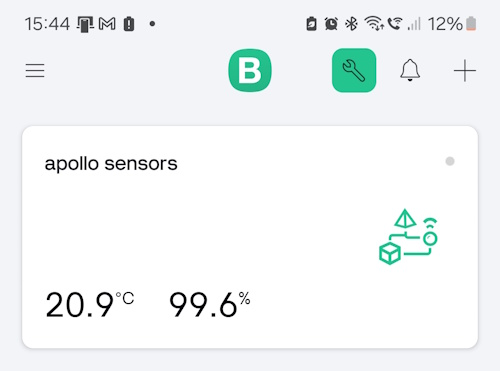

Takes in humidity and temperature readings.

An LED traffic light system is used to indicate whether water needs to be sprayed to raise humidity for Apollo - my partner's Crested Gecko.
Once the target has been met, the humidity needs to fall until the next scheduled time. Humidity needs to be higher at night.

## Setup 

I am using an ESP32-c3-mini zero. Here is the pin diagram for that board ([from waveshare.com](https://www.waveshare.com/esp32-c3-zero.htm)):


1. Create an env.py file.
2. Create a dict called 'variables' as MicroPython doesn't support enviroment variables.
3. Add the following enviroment variables:

variables['SSID'] - [str] Wifi ssid
variables['PASS'] - [str] Wifi password
variables['MORNING'] - [int] When morning schedule starts
variables['EVENING'] - [int] When night schedule starts
variables['CHANGE_FOOD_DAYS'] - [int] Number of days inbetween checking food
variables['BLYNK_AUTH_TOKEN'] - [str] Auth token for Blynk IoT

Copy over the files ([See make changes section](#make-changes)):
- env.py (that you just created)
- main.py
- micropython_ota.py
- ssd1306.py

### Setup Over The Air updates

variables['OTA_HOST'] - HTTP/HTTPS file server url containing updates.
variables['OTA_PROJECT_NAME'] - The folder name that contains the updates.

1. Add a folder with the OTA_PROJECT_NAME. 
   
2. In the folder, create a file called 'version' that contains the current version (eg v1.0.0).

3. For each version, create a directory with the version as the name (eg v1.0.0). Add the env.py and main.py files.

## Make changes

1. Connect a USB-C cable to the ESP32 and find the COM using device manager.

2. Connect using rshell and the COM you just found. ```rshell -p [COM8]```

4. Copy all the files over to the ESP32 using ```cp [filename].py /pyboard/```

3. Update the main.py by simply copying it over again. ```cp main.py /pyboard/```

### Over The Air updates

1. Create a new folder with the next version number (eg v1.0.1).
   
2. Add the new env.py and main.py files.
   
3. Update the 'version' file to match.

### Test 

Connect using a serial connection on an SSH client such as PUTTY.

1. Close rshell otherwise connection will be refused.

2. Input the COM and the speed recommended for your device. (likely 115200).

3. Press reset CTRL+C.

4. Import main

## Blynk app

Blynk allows you to use their app to view metrics. Temperature and humidity updates are sent to Blynk using an auth token. 

